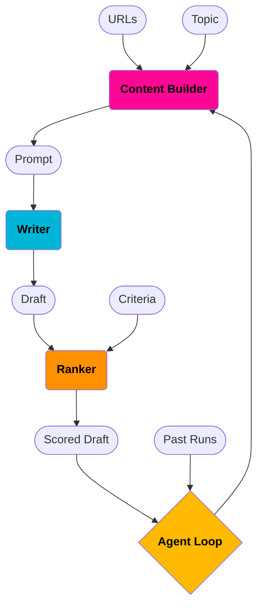

# Agentic AI Writer

### Data Model
- Input
  - URLs
  - Prompt *(i.e. topic)*
  - Criteria
- Output
  - Content *(i.e. scored drafts)*

### Data Flow

### Modules
- **Content Builder**
  - prompt builder
  - url parser
    - html-to-markdown
    - audio-to-text (podcasts) <- out-of-scope
    - youtube-to-text <- out-of-scope
- **Writer**
- **Ranker**
- **Agent Loop**

## AI Writer tasks #todo
- html-to-markdown url parser
- prompt builder
- writer
- ranker
- agent loop
